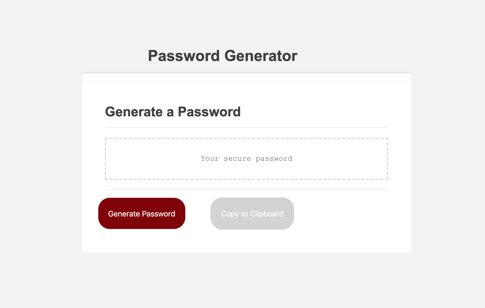

# PasswordGenerator

This is a *working* password generator made with vanilla JS. 

Upon clicking the red "Generate Password" button, the user will be asked a series of prompts to determine the desired length and character types of the password. 

The password will first appear as an alert, and then as text in the text box. 

The user then has the option to copy the password to their clipboard or restart the process of generating a new password.

## This password generator was made by Heidi Einholz in 2019.

You can use it if you want.

